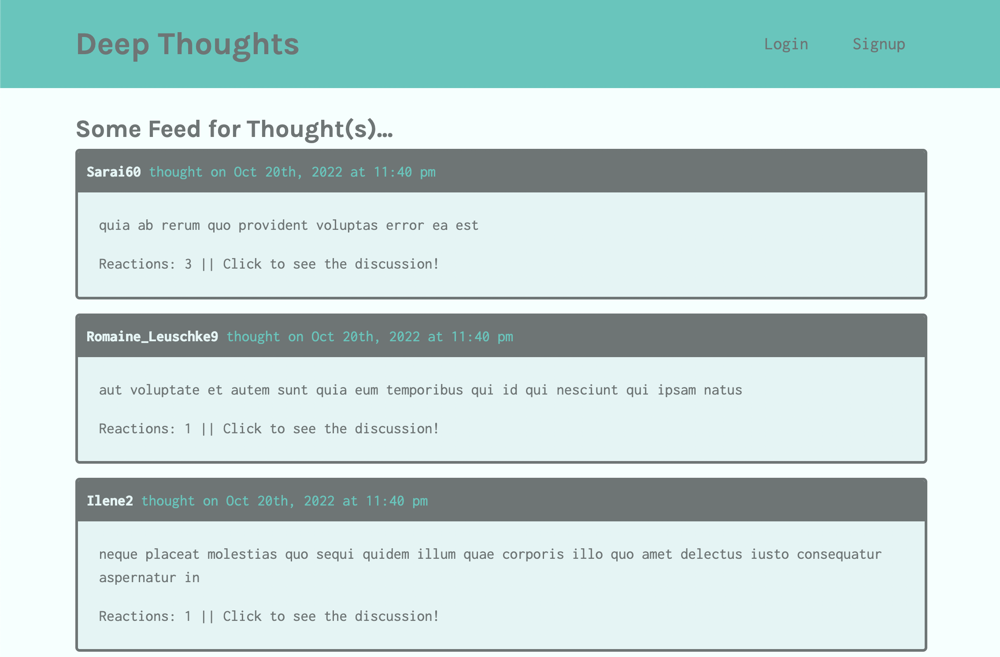

# deep-thoughts
Social media application called "Deep Thoughts," where users can create an account, post their thoughts for others to see, and interact with other users through these thoughts using MERN stack.

## Technology
* MongoDB
* Express
* React
* Node.JS
* GraphQL
* Mongoose
* Faker
* Bcrypt
* Apollo-server-express
* JWT

## Link to heroku deplyment
[Click here for Heroku link](https://deepthoughts22.herokuapp.com/)(Heroku changing free policies soon.)

## Screenshot

### Author & Contact Info
Boyd Roberts

[Coleyrockin Github](https://github.com/coleyrockin)

[Coleyrockin@aol.com](mailto:coleyrockin@aol.com)