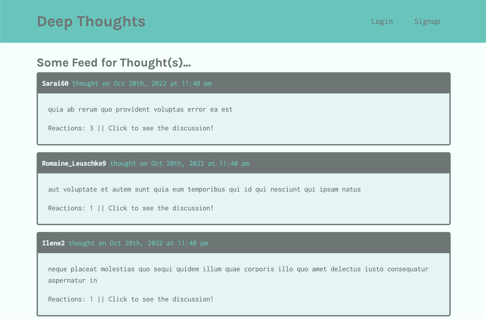

# Deep Thoughts


## About

A social media application built with the MERN stack and GraphQL where users can create an account, post their thoughts, and interact with other users through reactions. Features JWT-based authentication, seeded sample data via Faker, and a GraphQL API for all data operations.

## Features

- Create an account and log in with JWT-based authentication
- Post thoughts visible to all users
- Add reactions to other users' thoughts
- View individual user profiles with their thought history
- Friend other users
- GraphQL API with queries and mutations
- Database seeding with Faker-generated sample data

## Tech Stack

| Layer | Technology |
|-------|------------|
| Frontend | React 17, Apollo Client 3, React Router DOM 6 |
| Backend | Node.js, Express.js 4, Apollo Server Express 3 |
| Database | MongoDB, Mongoose 5 |
| Auth | JSON Web Tokens (JWT), bcrypt 4 |
| GraphQL | graphql 16 |
| Seeding | Faker 4 |
| Dev Tools | Concurrently, Nodemon 2 |

## Getting Started

```bash
# Clone the repository
git clone https://github.com/coleyrockin/deep-thoughts.git
cd deep-thoughts

# Install all dependencies (client + server)
npm install

# Seed the database
npm run seed

# Start the development server
npm run develop
```

The React frontend runs at `http://localhost:3000` and the GraphQL API is available at `http://localhost:3001/graphql`.

## Deployment

This app can be deployed to Render or Railway. Set the following environment variables:

- `MONGODB_URI` — your MongoDB connection string
- `JWT_SECRET` — a strong secret for token signing

## Project Structure

```
deep-thoughts/
├── client/
│   ├── public/
│   └── src/
├── server/
│   ├── config/
│   ├── models/
│   ├── schemas/
│   ├── seeders/
│   ├── utils/
│   └── server.js
└── package.json
```

---

> Built by [coleyrockin](https://github.com/coleyrockin)# Deep Thoughts
Social media application called "Deep Thoughts," where users can create an account, post their thoughts for others to see and interact with other users through these thoughts using MERN stack.

## Technology
* MongoDB
* Express
* React
* Node.JS
* GraphQL
* Mongoose
* Faker
* Bcrypt
* Apollo-server-express
* JWT

## Deployment (free hosting)
Heroku's free tier is gone, and this repo no longer includes any Heroku config. Use [Render](https://render.com/) free Web Service instead:
* Build command: `npm install && npm run build`
* Start command: `npm start`
* Environment: set `MONGODB_URI` to your database connection string and `JWT_SECRET` to a strong secret.
Render will provide the public URL after the first deploy. Railway's free tier works similarly if you prefer that platform.

## Screenshot


### Author & Contact Info
Boyd Roberts

[Coleyrockin Github](https://github.com/coleyrockin)

[Coleyrockin@aol.com](mailto:coleyrockin@aol.com)
